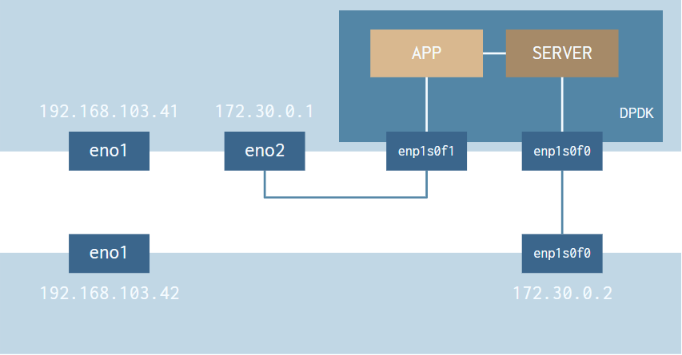

# DPDK stream analyzer
C++ framework for analyzing packets streams using DPDK

## Installation Linux

Intstall DPDK and cmake  
`sudo apt-get install dpdk-dev dpdk-doc libdpdk-dev dpdk cmake`

Setup Hugepages  
`echo 1024 | sudo tee /sys/kernel/mm/hugepages/hugepages-2048kB/nr_hugepages`  
`sudo mkdir /mnt/huge`  
`sudo mount -t hugetlbfs nodev /mnt/huge`  

Load kernel module  
`sudo modprobe uio_pci_generic`

Bind **at least 2** eth ports to said module  
`dpdk-devbind --status` - find number of eth port ( e.g. *01:00.0* )  
`dpdk-devbind --bind=uio_pci_generic <port_num>`

Compile source  
`cd dpdk-stream-analyzer`  
`mkdir build && cd build`  
`cmake ..`  
`make`

## Example 2-machine setup

## Usage
`./build/server -l 0 -n 1` - run server  
`./build/app -l 1 -n 1 --proc-type=secondary` - run app

